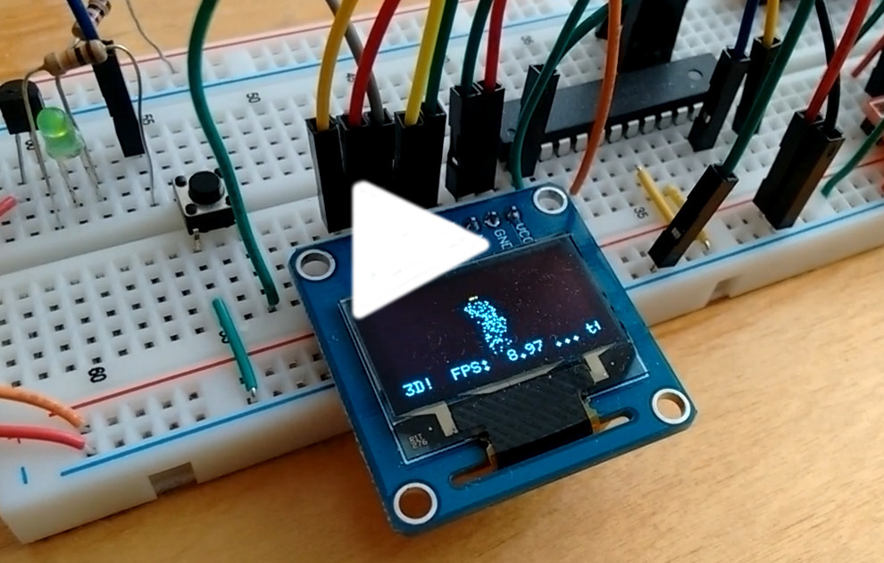

My [renderer](https://www.thanassis.space/renderer.html) is quite a "beast";
supporting many rendering modes. I've almost forgotten what it was like
when I begun playing with 3D code, 2 decades ago...

...so it was time for a trip "down memory lane": I implemented
the points-only mode on a "naked" ATmega328P sitting on a breadboard,
and had it drive an OLED screen via SPI at the magnificent resolution
of 128x64 :-)

This was fun :-)

Points of note:

- Fixed point calculations, of course (8 bits for the fractional part)
- I stored and read the statue data from the .text segment (Google
  PROGMEM).  Even though the ATmega328P has 32KB of flash available to
  store the program code, it only has 2K of RAM. So I use the flash
  storing the code to also store the constant data of the XYZ point
  coordinates.
- Bonus "distance LED": shines brightly when the statue gets close :-)
- Conditionally outputs FPS info to serial port.
- The code uses the U8G2 library to access the OLED; edit file myscreen.h
  to define the appropriate constructor for your own OLED.
- I had to use SPI in two places: the ATmega328P drives the OLED via its
  SPI pins, but it is itself programmed via the SPI pins of the "big
  brother" siting on the right of the breadboard: a Raspberry PI2 I use to
  program the ATmega328P's flash via
  <a href="contrib/avrdude_gpio.conf.patch">avrdude</a>.
  And yes, the SPI pins are shared.

Thoroughly enjoyed playing with HW again :-)
